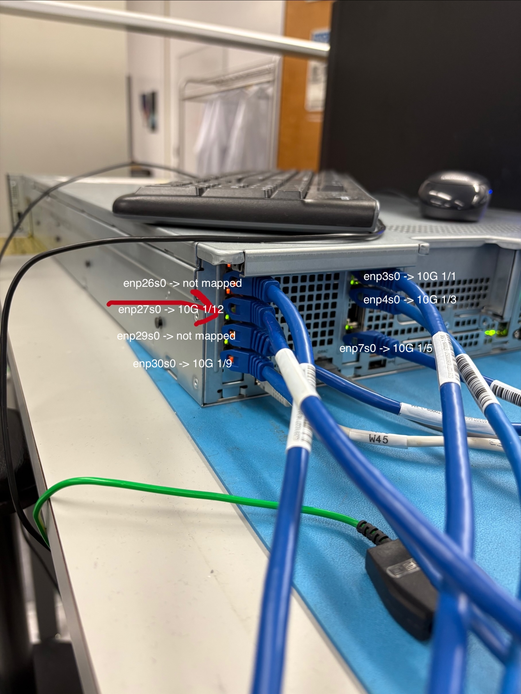

= Switch mappings and topology

ngasrv0 NICs are mapped to the following ports on the switch (ngatsnsw2) (warning: this may be outdated)

[cols="1,2,2,3"]
|===
| ngasrv0 NIC | MAC | Switch Port (ngatsnsw2) | Notes

| enp3s0
| 24:5e:be:88:af:37
| 10G 1/1
|

| enp4s0
| 24:5e:be:88:af:36
| 10G 1/3
|

| enp6s0
| 24:5e:be:88:af:35
| not connected
|

| enp7s0
| 24:5e:be:88:af:34
| 10G 1/5
|

| enp26s0
| 24:5e:be:8a:9c:1b
| Not connected
| Igor using for time agreement work?

| enp27s0
| 24:5e:be:8a:9c:1a
| 10G 1/12
|

| enp29s0
| 24:5e:be:8a:9c:19
| Not connected
|

| enp30s0
| 24:5e:be:8a:9c:18
| 10G 1/9
|
|===

